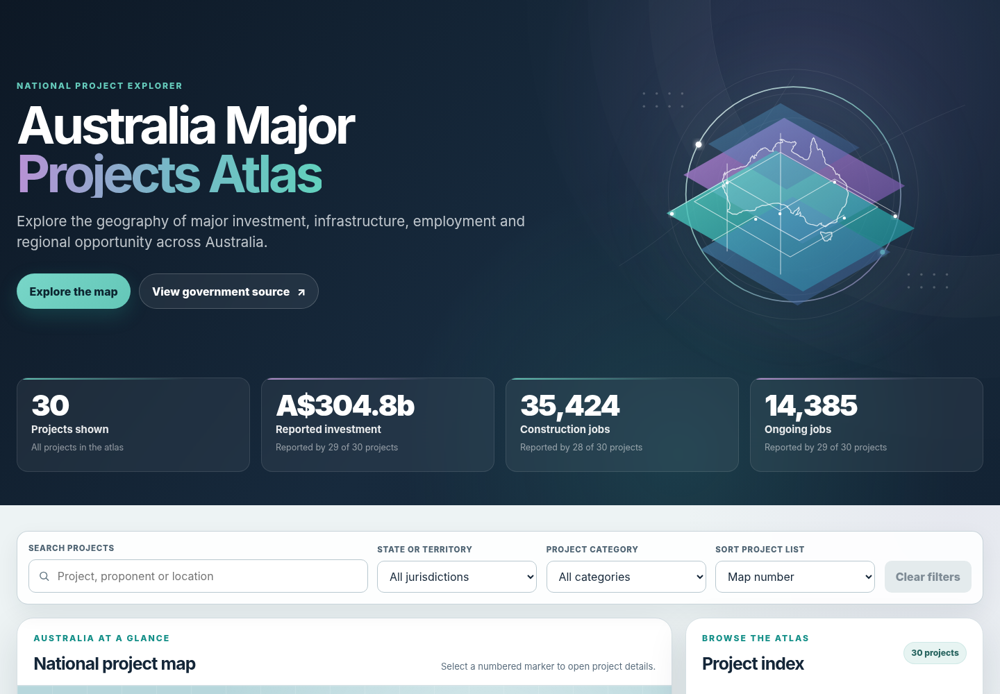

# Australia Major Projects Atlas

**Mapping major projects, infrastructure, jobs and regional opportunity across Australia.**

👉 **[Open the Major Projects Explorer](https://yusufaligeo5.github.io/australia-major-projects-atlas/)**

---

The **Australia Major Projects Atlas** is an independent GIS and data visualisation project exploring where major investment projects are located, how they connect to surrounding regions, and what they may mean for communities, infrastructure and employment.

The atlas is designed as a growing collection of national and project-specific maps. It brings together a searchable national explorer, detailed map briefs, interactive web maps, ArcGIS StoryMaps and other visual products.

## What the atlas includes

### Major Projects Explorer

The **Major Projects Explorer** is the main national map. It allows users to:

- search for major projects across Australia;
- filter projects by location and project type;
- compare reported investment and employment figures;
- view project descriptions and key information; and
- discover more detailed project maps as they are added.

The explorer is intended as a simple starting point for understanding the national distribution of major projects.

### Project Map Briefs

Selected projects will receive their own detailed map briefs.

These briefs will usually focus on two questions:

1. **What is being built, and where?**  
   This may include the project site, transport links, transmission lines, ports, nearby communities and other supporting infrastructure.

2. **What could the project mean for the region?**  
   This may include construction jobs, long-term employment, workforce readiness, local industries, training opportunities and possible supply-chain benefits.

The content will vary depending on the project. For example, an offshore wind project may focus on ports, marine services and electricity connections, while a mining project may focus on freight, processing, energy, water and workforce access.

The **Star of the South** offshore wind project is the first pilot for this format.

### Interactive ArcGIS Products

The atlas may also include:

- ArcGIS Online web maps;
- ArcGIS StoryMaps;
- dashboards;
- project-specific interactive applications; and
- downloadable static maps.

These products will provide additional detail and allow users to explore project geography more closely.

## Why this project exists

Major projects are often described through large investment and employment figures, but those numbers do not always show how a project connects to the places around it.

The atlas aims to make that relationship easier to understand by combining:

- **project geography** — where projects and supporting infrastructure are located;
- **community geography** — which towns, regions and workforces are nearby; and
- **economic geography** — where jobs, services and supply-chain opportunities may emerge.

The goal is not only to show where a project is located, but also how it may fit into the wider regional landscape.

## Current status

The **Major Projects Explorer** is available as a working first version.

The next stages of the atlas will focus on:

- improving the national explorer;
- creating a consistent visual style for the series;
- developing project-specific map briefs;
- publishing selected interactive ArcGIS maps;
- building a flagship StoryMap; and
- expanding the atlas across different project types and regions.

## Planned project themes

The atlas may include projects from sectors such as:

- renewable energy;
- offshore wind;
- hydrogen;
- critical minerals;
- mining and mineral processing;
- advanced manufacturing;
- transport and logistics;
- energy infrastructure; and
- digital infrastructure.

Projects will be selected based on their scale, regional importance, available public information and mapping potential.

## Data and map notes

The atlas uses publicly available information from government, project proponents and other open sources.

Investment and employment figures are generally based on published project estimates. They may change as projects develop and should not be treated as guaranteed outcomes.

Some locations in the national explorer are approximate regional reference points rather than exact project boundaries. Detailed project maps will clearly distinguish between confirmed locations, proposed routes and approximate areas.

Official government, planning and project sources should be consulted for the most current legal, technical or investment information.

## Project links

As the atlas grows, this repository will include links to:

- the national Major Projects Explorer;
- project-specific map briefs;
- interactive ArcGIS maps;
- StoryMaps;
- dashboards; and
- supporting sources and notes.

## Disclaimer

The **Australia Major Projects Atlas** is an independent GIS and data visualisation project.

It is not an official Australian Government product and is not affiliated with project proponents unless explicitly stated.

## Author

Created by **Yusuf Ali** as an independent GIS, cartography and regional economic analysis project.
